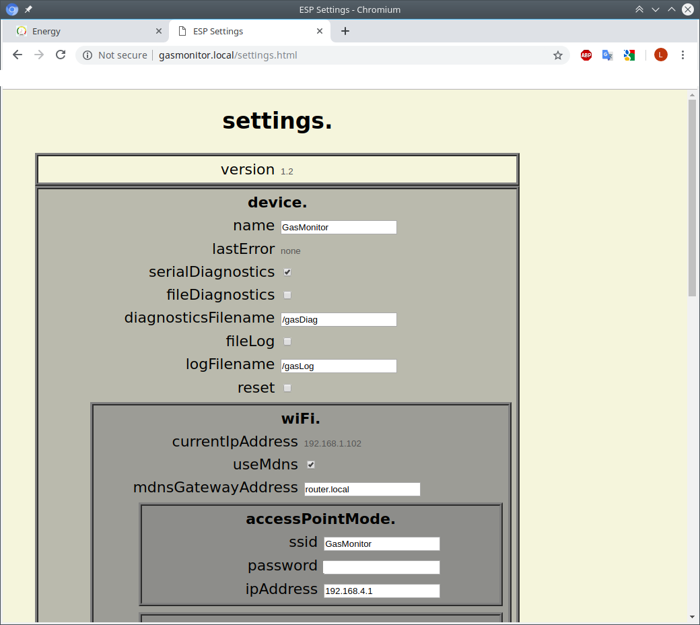
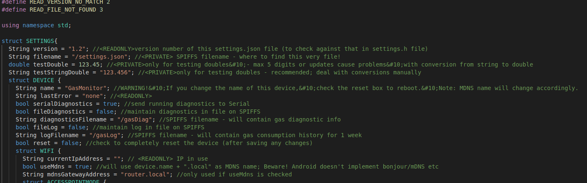
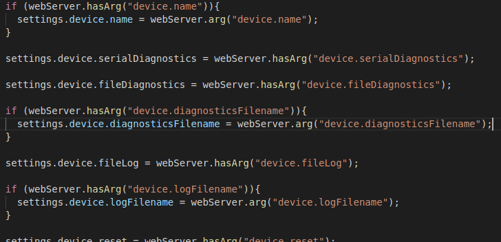

# json2settings
*WARNING! NOT READY FOR PUBLIC CONSUMPTION YET

From this:

To this:

and this:

and this:

jason2settings is a command line application which converts a commented or uncommented json specification into an include file, html form page and an include file containing snippets for handling updates.

To get started:
  see: [Compiling json2settings](docs/Compiling_json2settings.md)
  see: [Using json2settings](docs/Using_json2settings.md)

Old man(ish) page: (read the files in the docs folder too!)
 * NAME
 *    jason2settings - translate a json specification to c++ header file and html form
 * 
 * SYNOPSIS
 *    jason2settings [OPTION]...
 * 
 * DESCRIPTION
 *    
 *    A CLI program to read a (possibly double slash commented) json file from stdin and write (to stdout) a C++ struct based settings header file.
 * 
 *    It can also produce a starter html form page to amend those settings.
 * 
 *    Any comments in the json file optionally translate to comments in the header file and optionally translate to tooltips in the form file.
 * 
 *    Fields with comments that include the tag "<PRIVATE>" will appear in the header file but not as a field in the form file.
 *    Children of fields with comments that include the tag "<PRIVATE>" will appear in the header file but not as a field in the form file.
 * 
 * OPTIONS
 * 
 *    -f filename
 *        write an html form page to filename
 * 
 *    -t
 *        transfer json comments to header file
 * 
 *    -n structname
 *        by default, the settings structure is labelled "SETTINGS" and the object is called "settings". This option changes them to "STRUCTNAME" and "structname" respectively.
 * 
 * EXAMPLES
 *  To produce a header file:
 *    jason2settings < mysettings.json > mysettings.h
 * 
 *  To produce a header file with struct called "prefs" rather than "settings":
 *    jason2settings -n prefs < mysettings.json > mysettings.h
 * 
 *  To produce a header file with comments from a commented json file:
 *    jason2settings -t < mycommentedsettings.json > mycommentedsettings.h
 * 
 *  To produce an html form file:
 *    jason2settings -f mysettings.html < mysettings.json
 *  
 *  To produce a header file with comments and an html form file:
 *    jason2settings < mysettings.json -t -f mysettings.html
 * 
 * BUGS/FEATURES
 *  json comments must :
    *  be single line
    *  be double slash only
    *  occur after the setting definition
    *  not be naked - ie. not occurring on a line on their own.
    *  be immediately preceded by a space eg: "this" : "that",\<SPACE\>//comment
 *  html ouput is ragged; visual studio code does a good job of formatting it though!
 *  json arrays are NOT implemented - behaviour is undefined.
 *  CLI parameters are not checked adequately for missing filenames etc.; eg: json2settings -f -t will write a file called "-t".
 *  json files must be properly (pretty) formatted with newlines after each field.
 *  json output (to settings.json, say) is prettyprinted and wasteful of ESP space in SPIFFS because it's easy to dump/debug. It ought to have a switch to turn prettyprinting off.
 
